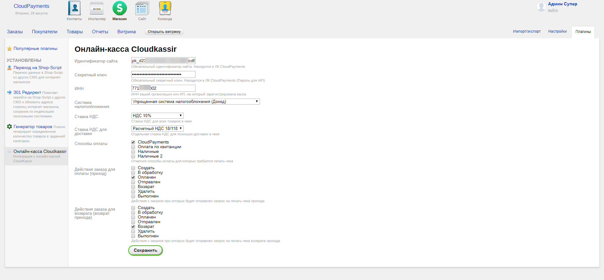

#  CloudKassir модуль для Shop-Script
Модуль позволяет интегрировать онлайн-кассу [CloudKassir](https://cloudkassir.ru) в интернет-магазин на  Shop-Script. 
Для корректной работы модуля необходима регистрация в сервисе.

### Возможности:  
	
* Автоматическая отправка чеков прихода;
* Отправка чеков возврата прихода;
* Отправка чеков на email клиента;
* Отправка чеков по SMS;

### Совместимость:
Webasyst 2.4.4 и выше;
ShopScript 7.5.1 и выше;

## Установка модуля
Установка модуля производится через приложение "Инсталлер" в Shop-Script

## Настройка модуля
Для настройки модуля в разделе "Плагины" приложения "Магазин" найдите модуль "Онлайн-касса Cloudkassir" и нажмите на его название.

Укажите следующие настройки:
* **Идентификатор сайта** — Public id сайта из личного кабинета CloudPayments
* **Секретный ключ** — API Secret из личного кабинета CloudPayments
* **ИНН** — ИНН организации, на которую зарегистрирована онлайн-касса
* **Система налогообложения** — Тип системы налогообложения.
    Возможные значения перечислены в документации CloudPayments https://cloudpayments.ru/Docs/Directory#taxation-system
* **Ставка НДС** — Указание ставки НДС по умолчанию.
    Все возможные значения указаны в документации https://cloudpayments.ru/Docs/Kassa#data-format
    Обратите внимание, если у товара указана ставка НДС, то используется налог указанный у товара.
* **Ставка НДС для доставки** — Указание отдельной ставки НДС для доставки.
    Если доставка платная, то она в чеке оформляется отдельной строкой со своей ставкой НДС.
    Значения аналогично ставке НДС для товаров.
* **Способы оплаты** — Выберите способы оплаты, при которых требуется пробивать чек
* **Действия заказа для оплаты (приход)** — Выберите статусы, при которых требуется пробивать чек продажи. По умолчанию чек пробивается при смене статуса на "Оплачен" 
* **Действия заказа для возврата (возврат прихода)** —  Выберите статусы, при которых требуется пробивать чек продажи. По умолчанию чек пробивается при смене статуса на "Возврат"

Затем сохранить введенные параметры.

